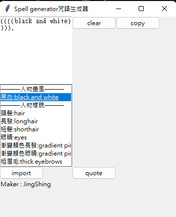
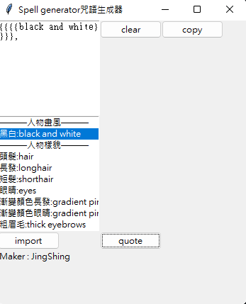
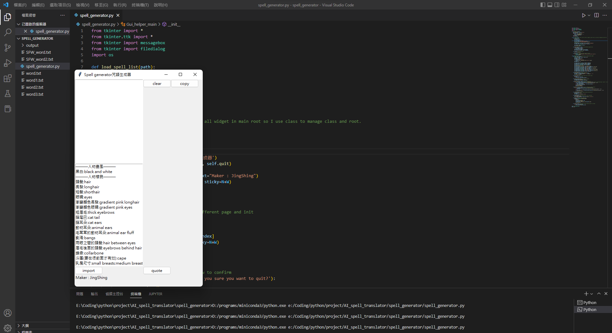
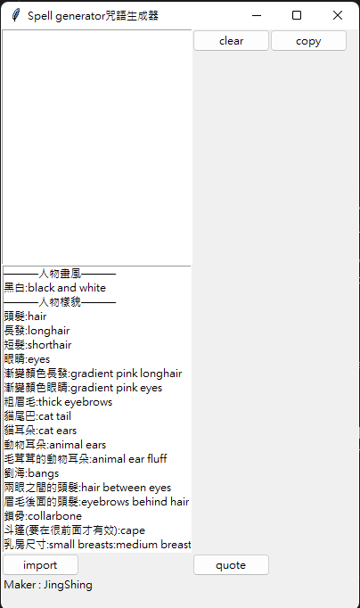

English | [繁體中文](README_TCH.md)
# AI-Drawing-Spell-generator
A generator help you spawn key word for AI drawing

You can double click word add it to the text area.

You can customize your own word dictionary. By editing txt file.

You can import your own word dictionary.
# Update
## Quote function
it can now by double clicking same word to add quote to this word.

## Convert Quote
Add quote change button to change '()' to '{}'.

## New UI size

# NEW UI

# Spell Dictionary Format
## "Description:Tag"
Example $\Rightarrow$ This is an tag for something:tag

# Log
## ver 1.0
* it can import spell dictionary to spell generator.
* it can customize the spell dictionary to what tag you want.
* it can through double click to add word to your spell.
* it can copy the content in the text box using copy button.
* exe release
## ver 1.1
* it can now by double clicking same word to add quote to this word.
* Add quote change button to change '()' to '{}'.
## ver 1.1.1
* Resize UI
