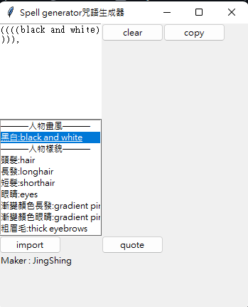
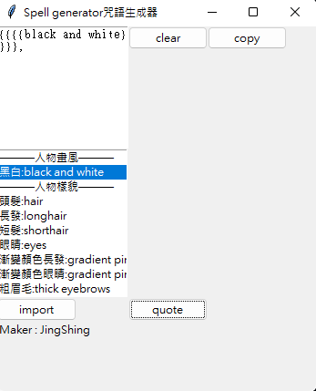
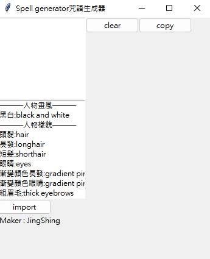

[English](README.md) | 繁體中文
# AI做圖咒語生成器
一個幫你生成咒語的產生器。

你可以雙擊詞條添加到文字框的區域。

可以自訂詞典，更改內容，直接更改txt就可以更改詞條。

也可以透過 import 導入自己的詞典。
# Update更新
## 括號強調
可以透過重複雙擊同一個關鍵詞，來增加括號。

## 括號轉換(對應不同版本)
新增 quote 按鈕把 '()' 轉換成 '{}'.

# UI

